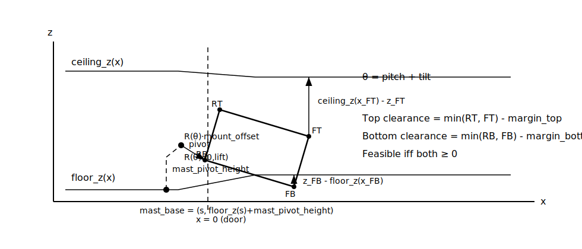
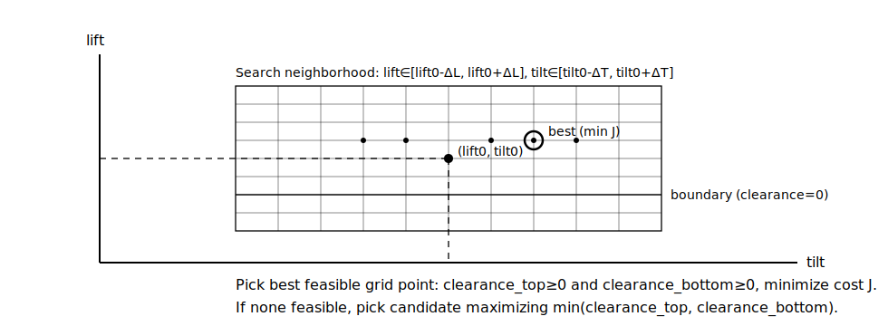
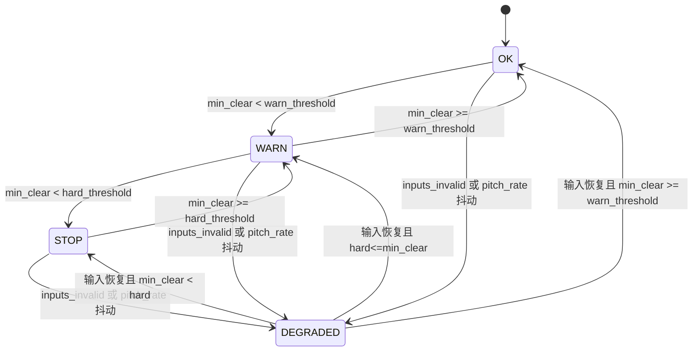

# 算法原理：网格可行域搜索的净空约束控制（MVP）

本文描述本仓库当前 **C++17 控制内核** 的算法原理，严格对应现有实现（见 `src/Controller.cpp`、`src/Geometry.cpp`、`include/controller/Types.hpp`）。

目标：在叉车驶入货柜车厢的过程中（坡道/门口/车厢内外过渡），由于车体 `pitch` 变化与地形高度变化，料笼（rack）与**顶棚/地板**的上下净空会快速变化。控制器每帧根据简化几何计算净空，并在当前 `(lift, tilt)` 附近做轻量搜索，输出新的目标与限速，尽量保持上下净空“居中”，同时提供安全等级与退化策略。

---

## 0. 图示（建议先看图再看公式）

说明：本文中的 Mermaid 图在 GitHub / VS Code（支持 Mermaid 的 Markdown 预览）可直接渲染；若你的预览不支持 Mermaid，可先看下面两张 SVG 静态图。

### 0.1 几何与净空（角点、顶棚/地板、净空定义）



### 0.2 局部网格搜索（围绕当前 lift/tilt 的候选网格）



### 0.3 每帧控制主流程（Mermaid）

```mermaid
flowchart TD
	A[ControlInput: dt, s, pitch, pitch_rate, lift, tilt, env] --> B{输入有效?\nfinite + dt>0 + inputs_valid}
	B -- 否 --> B1[进入 DEGRADED\nmargin↑ rate↓ speed↓]
	B -- 是 --> C[正常参数]
	B1 --> D
	C --> D[计算角点 corners(s,lift, pitch, tilt)]
	D --> E[计算净空\nclearance_top/bottom\n(可选 lookahead)]
	E --> F[在 (lift,tilt) 邻域网格搜索]
	F --> G{存在可行候选?\n(top>=0 && bottom>=0)}
	G -- 是 --> H[最小化代价 J\n(居中 + 动作幅度 + 平滑)]
	G -- 否 --> I[回退: 最大化 min(clearance_top, clearance_bottom)\n并输出 NoFeasibleSolution]
	H --> J[输出命令: lift_target, tilt_target\n+ rate_limit]
	I --> J
	J --> K[计算 speed_limit\n(净空逼近/抖动/退化)]
	K --> L[生成 SafetyStatus\nOK/WARN/STOP/DEGRADED]
```

### 0.4 安全等级状态机（Mermaid）



## 1. 建模与坐标

### 1.1 2D 侧视模型（x-z 平面）

- $x$：车辆行驶方向；进入车厢方向为正
- $z$：竖直向上

控制器用一个 2D 矩形近似料笼：

- `rack.length_m`：矩形沿 $x$ 的长度
- `rack.height_m`：矩形沿 $z$ 的高度
- `rack.mount_offset_m`：从货叉铰点（fork pivot / carriage pivot）到“后下角”（RearBottom）的偏置（在零角度 rack 坐标下定义，随后随 rack 旋转）

### 1.2 姿态叠加

- `pitch_rad`：车体俯仰角（车头上扬为正）
- `tilt_rad`：货叉相对车体的俯仰角（叉尖上扬为正）

料笼相对世界的总俯仰为：

$$\theta = pitch + tilt$$

旋转矩阵（绕 $y$ 轴，对应 x-z 平面旋转）在实现中用 `Rot2` 表示。

### 1.3 进度 s

`s_m` 定义为：桅杆底座（mast base）的世界 $x$ 位置（米）。它是上层定位/里程计给控制器的“进入车厢进度”。

---

## 2. 环境几何：顶棚/地板高度

控制器支持三种形式描述环境顶棚/地板高度（优先级从高到低）：

1) 回调函数：`ceiling_z_at_x_m(x)` / `floor_z_at_x_m(x)`
2) 平面：`ceiling_plane` / `floor_plane`，形式 $ax+by+cz+d=0$（MVP 假设 $y=0$）
3) 常数：`ceiling_z_m` / `floor_z_m`

因此顶棚/地板高度可以是随 $x$ 变化的分段/坡道模型（通过回调实现）。

---

## 3. 运动学：由 (s, lift, pitch, tilt) 得到四个角点

控制器使用以下 2D 运动学契约（见 `include/model/Geometry.hpp` 注释与 `src/Geometry.cpp`）：

1) 取总角度 $\theta = pitch + tilt$，构造旋转 $R(\theta)$

2) 桅杆底座在世界坐标：

$$mast\_base = (s,\; floor\_z(s) + mast\_pivot\_height)$$

其中 `mast_pivot_height_m` 为桅杆铰点相对局部地面的固定高度（MVP 参数）。

3) 货叉铰点（carriage pivot）沿桅杆方向移动。注意：实现里 `lift_m` 是沿 rack/桅杆坐标系的“+z 方向位移”，不是世界 $z$：

$$pivot = mast\_base + R(\theta) \cdot (0,\; lift)$$

4) 料笼后下角（RearBottom）与其它角点：

$$RB = pivot + R(\theta)\cdot mount\_offset$$
$$RT = RB + R(\theta)\cdot (0,\; height)$$
$$FB = RB + R(\theta)\cdot (length,\; 0)$$
$$FT = RB + R(\theta)\cdot (length,\; height)$$

最终得到 4 个角点 `CornerPoints2D`。

---

## 4. 净空定义（上下约束）

对顶棚/地板分别取“最危险角点”的净空，并减去 margin：

- 顶部净空（取两上角点最小值）：

$$clearance_{top} = \min_{p\in\{RT,FT\}} \big( ceiling\_z(x_p) - z_p \big) - margin_{top}$$

- 底部净空（取两下角点最小值）：

$$clearance_{bottom} = \min_{p\in\{RB,FB\}} \big( z_p - floor\_z(x_p) \big) - margin_{bottom}$$

其中：
- `margin_top_m` / `margin_bottom_m` 来自配置 `ControllerConfig`
- “最危险角点”用于诊断输出 `worst_point`

可行性判定（MVP）：

$$clearance_{top} \ge 0 \quad \text{且} \quad clearance_{bottom} \ge 0$$

---

## 5. 每帧控制：局部网格搜索 + 代价最小

控制器每个周期输入当前状态（`lift_pos_m`, `tilt_rad`, `pitch_rad`, `s_m` 等），然后在当前附近做网格搜索。

### 5.1 搜索域

以当前状态为中心：

- $lift \in [lift_0-\Delta L,\; lift_0+\Delta L]$
- $tilt \in [tilt_0-\Delta T,\; tilt_0+\Delta T]$

其中：
- `search_lift_half_range_m = \Delta L`
- `search_tilt_half_range_rad = \Delta T`
- 网格分辨率：`grid_lift_steps` × `grid_tilt_steps`

### 5.2 可选：s 方向前视（lookahead）

若 `lookahead_s_m > 0`，控制器会在 $s$ 与 $s+lookahead$ 两个位置都评估净空，并以二者“更差者”作为候选解的约束与代价依据：

$$clearance^{worst} = \min( clearance(s),\; clearance(s+lookahead) )$$

直觉：避免“刚好在门口可行，但再前进一点就不可行”的卡死现象。

### 5.3 居中目标与代价函数

定义“居中差”变量：

$$mid = clearance_{top}^{worst} - clearance_{bottom}^{worst}$$

目标是 $mid \to 0$，即让上下净空尽量平衡。

对每个可行网格点，代价为（对应 `src/Controller.cpp`）：

$$J = w_{center} \cdot mid^2 + w_{dl}(lift-lift_0)^2 + w_{dt}(tilt-tilt_0)^2 + w_{smooth}(\Delta \dot{lift}^2 + \Delta \dot{tilt}^2)$$

其中：

- $\dot{lift} = (lift-lift_0)/dt$，$\dot{tilt} = (tilt-tilt_0)/dt$
- $\Delta \dot{lift} = \dot{lift} - \dot{lift}_{prev}$，$\Delta \dot{tilt} = \dot{tilt} - \dot{tilt}_{prev}$
- `prev_*` 来自控制器内部的“上一帧指令速率记忆”，用于抑制抖动（对调用方仍是“每帧一步”的接口）

权重参数与名称：
- `w_center`, `w_dl`, `w_dt`, `w_smooth`

最终选择 $J$ 最小的可行点作为 $(lift^*, tilt^*)$。

### 5.4 无可行解的回退

若整个局部网格无可行点，控制器不会直接输出“原地不动”，而是回退到：选择使

$$\min(clearance_{top}^{worst},\; clearance_{bottom}^{worst})$$

最大的候选点（即“最小违反/最安全”），并输出诊断码 `NoFeasibleSolution`。

---

## 6. 输出：位置目标 + 速率限制 + 限速

控制器输出 `ControlCommand`：

- `lift_target_m = lift*`（位置目标）
- `tilt_target_rad = tilt*`（角度目标）
- `lift_rate_limit_m_s`、`tilt_rate_limit_rad_s`（给上层/底层做限速跟踪）

此外给出 `speed_limit_m_s`，用于建议车辆前进速度。

### 6.1 简易限速策略

令当前（含可选前视）最小净空：

$$min\_clear = \min(clearance_{top}^{worst},\; clearance_{bottom}^{worst})$$

限速由三部分缩放：

- 净空因子（越接近 0 越慢）：

$$clearance\_factor = clamp(\frac{min\_clear}{warn\_threshold},\; 0,\; 1)$$

- pitch_rate 因子（姿态变化快则更慢）：实现中按 `pitch_rate_jitter_threshold_rad_s` 做线性衰减并下限到 0.2
- 退化因子（见下一节）

若 `min_clear` 低于 hard 阈值附近，直接把速度限到 0（停止）。

---

## 7. 安全等级与退化模式（DEGRADED）

### 7.1 安全等级

控制器输出 `SafetyStatus`：

- `OK`：最小净空 $\ge warn\_threshold$
- `WARN`：最小净空 $< warn\_threshold$
- `STOP`：最小净空 $< hard\_threshold$（实现里加入了很小的 `epsilon` 防止数值抖动导致误触发）

同时输出：`clearance_top_m`、`clearance_bottom_m`、`worst_point` 及原因码。

### 7.2 退化模式触发

满足以下任一条件进入 `DEGRADED`：

- `inputs_valid == false` 或输入存在非有限数（NaN/Inf）或 `dt` 异常
- `abs(pitch_rate_rad_s) > pitch_rate_jitter_threshold_rad_s`（视为姿态抖动/测量抖动）

退化模式的策略（通过配置倍乘）：

- margin 放大：`degraded_margin_multiplier`
- 执行器速率限缩小：`degraded_rate_multiplier`
- 车辆速度上限缩小：`degraded_speed_multiplier`

直觉：当输入不可靠时，宁愿保守（更大余量、更慢动作、更低车速）。

---

## 8. 计算量与适用边界

- 单帧计算量主要来自网格搜索：$O(N_L \cdot N_T)$（默认 9×9）
- 每个候选点只做常数次角点计算与净空计算，适合实时运行与可视化调参

MVP 边界/简化：
- 仅 2D 侧视（不建模左右摆、横向偏移）
- 料笼用矩形包络；环境用顶棚/地板高度函数（或平面/常数）
- 不做全局规划或 MPC，仅做局部可行域搜索（稳定、易解释、可调参）

---

## 9. 对照：关键参数（ControllerConfig）

- 约束与阈值：`margin_top_m`, `margin_bottom_m`, `warn_threshold_m`, `hard_threshold_m`
- 搜索：`search_lift_half_range_m`, `search_tilt_half_range_rad`, `grid_lift_steps`, `grid_tilt_steps`, `lookahead_s_m`
- 代价：`w_center`, `w_dl`, `w_dt`, `w_smooth`
- 限制：`base_lift_rate_limit_m_s`, `base_tilt_rate_limit_rad_s`, `base_speed_limit_m_s`, `min_speed_limit_m_s`
- 退化：`pitch_rate_jitter_threshold_rad_s`, `degraded_*_multiplier`
